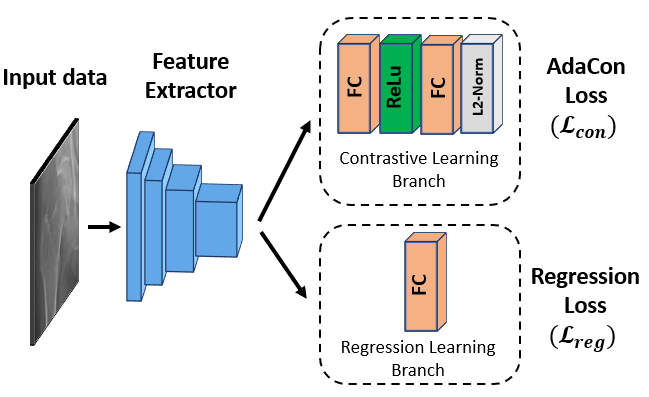

# IEEE TMI 2021: AdaCon: Adaptive Contrast for Image Regression in Computer-Aided Disease Assessment





This is the implementation of AdaCon on the EchoNet-Dynamic Dataset for the paper ["AdaCon: Adaptive Contrast for Image Regression in Computer-Aided Disease Assessment"](http://arxiv.org/abs/2112.11700) (IEEE TMI).

<br />
<br />

## Data

Researchers can request the EchoNet-Dynamic dataset at https://echonet.github.io/dynamic/ and set the directory path in the configuration file, `echonet.cfg`.

<br />
<br />


## Environment

It is recommended to use PyTorch `conda` environments for running the program. A requirements file has been included. 

<br />
<br />

## Training and Testing

The code must first be installed by running 
    
    pip install --user .

under the `adacon` directory. To train the model from scratch, run:

```
echonet video --frames=32 --model_name=r2plus1d_18 --period=2 --batch_size=20 --run_test --output=training_output
```

<br />
<br />

## Pretrained Model

A trained version of the model can be downloaded from https://hkustconnect-my.sharepoint.com/:u:/g/personal/wdaiaj_connect_ust_hk/EXu95kAzcitGibTOWxwSmDEBKIAia3H8Dw5CbGVDsPbWBg?e=QBzdD6

Inference with the trained model can be run using

```
echonet video --frames=32 --model_name=r2plus1d_18 --period=2 --batch_size=20 --run_test --output=training_output --weights=<PATH TO MODEL> --num_epochs=0
```

<br />

|           | MAE   | RMSE   | R<sup>2</sup>   |
| ---------- | :-----------:  | :-----------: | :-----------:  |
| AdaCon    | 3.86    | 5.07   | 82.8%  |


<br />
<br />

## Notes
* Contact: DAI Weihang (wdai03@gmail.com)

<br />
<br />

## Citation
If this code is useful for your research, please consider citing:

```
@article{dai2021adaptive,
  title={Adaptive Contrast for Image Regression in Computer-Aided Disease Assessment},
  author={Dai, Weihang and Li, Xiaomeng and Chiu, Wan Hang Keith and Kuo, Michael D and Cheng, Kwang-Ting},
  journal={IEEE Transactions on Medical Imaging},
  year={2021},
  publisher={IEEE}
}
```